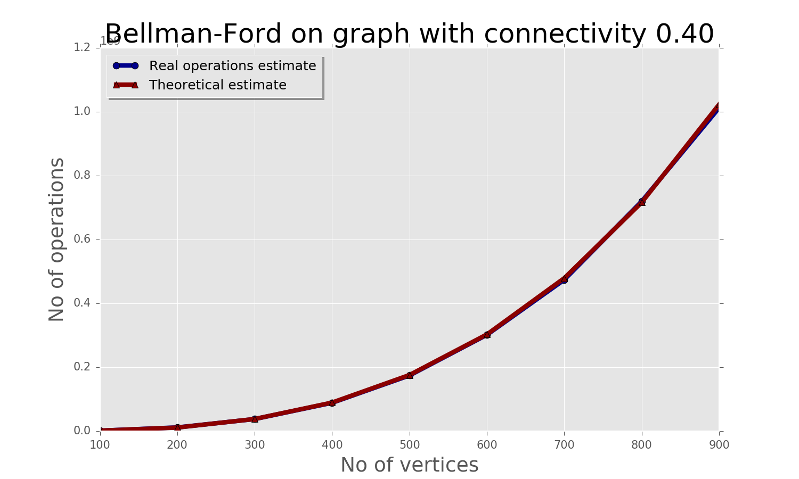
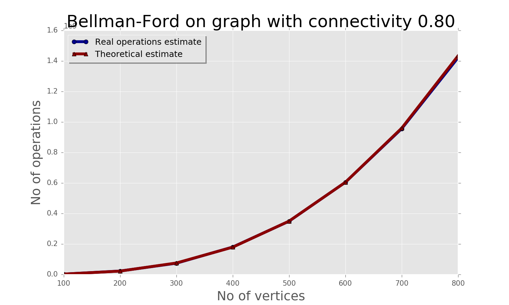
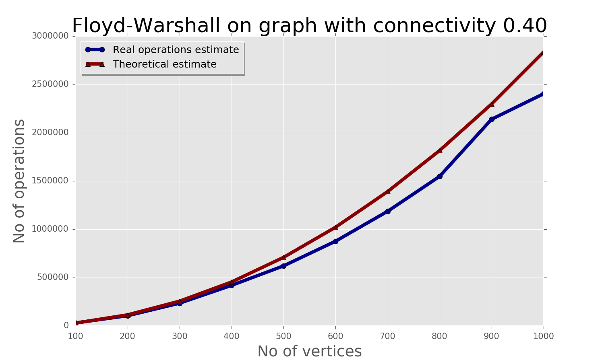
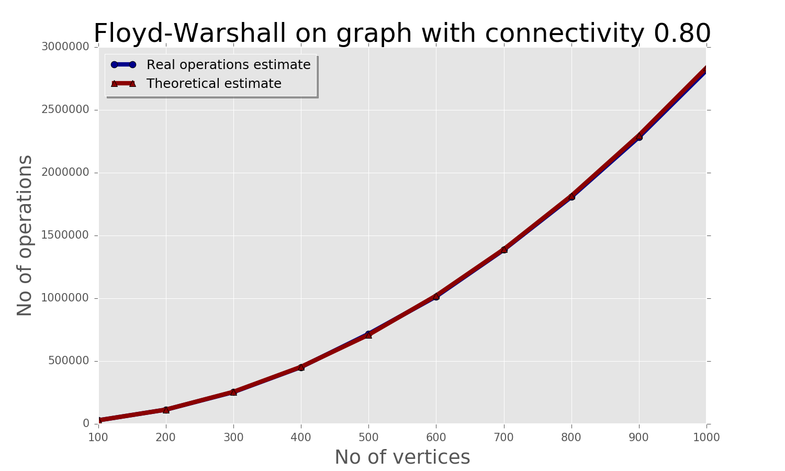

#Introduction

This coursework was prepared by masters of Data Science program Ukrainian Catholic University in 2016 year. The report is a result of listening "Algorithms and Data Structures" course. 

All files relate to this project are hosted on [GitHub](https://github.com/rudnitskih/ucu-adc-coursework). This report was created using Markdown language; please read [original file](./README.md) because some formatting can be wrong in PDF file.

## The importance of the course for us
There is an opinion that today Software Developer should not know how algorithms work. Every algorithm or data structures already exist, and the developer can just reuse them. 

Data Science field has the same problem: anyone can pick up a dataset, follow a YouTube video and fit a model in R, Python, etc. No one really needs to know the math behind it to be able to get a result.

However, that doesn't mean that it is the right or the best result. It is just a result. Maybe it's the wrong model for the question or data, maybe it's not (and often won't be) validated.

It is the same with algorithms and data structures. If you can write a couple of lines of code, you probably can grind your way to a result. It most likely won't perform as it could or be maintainable as it should but it is a result.

Analyzing data is a huge task. It requires a lot of logic, and if you have the correct data structures in place, then it would add the efficiency to your dataset. Definitely, you can use distributed computing to make your life easier, but it's critical to have the right algorithm in place. Otherwise, it will take a lot longer than developer think. But you can successfully finish your task regarding accuracy by using proper code structure and logic too.

Every developer should know about arrays, key value pairs, hash table, dictionary, queues, and stack as he would use them a lot. Study threads too so you can analyze multiple files at the same time by running in threads. So it comes down to 1 thing, if you know the data structures and where to use them, you can also implement them in the right place while analyzing data.
A data scientist with less knowledge about software engineering is limited than otherwise.

Nowadays, with the tools and information that are available, is no longer a matter of doing something, but a matter doing it well. That kind of knowledge is the differentiating factor between average and best developers.

## Structure of this course work
Our group has a number #1. Hence, we have **Variant 1** in **Advanced Sorting** part and **Variant 6** in **Algorithms on Graphs**. 
The report contains following parts:

- **Introduction**, you are reading now this part.
- **Sorting**, describes comparison Heapsort and Quicksort algorithms on reals and dates data types.
- **Graph Processing**, contain two subsections:
	- **Problem 1: Dijkstra's Shortest-Path Algorithm** - implementation Straightforward and Heap-based Dijkstra’s algorithms for USA National motorway network.
	- **Problem 3: Negative Weight Cycle Detection** - modifications of Bellman-Ford and Floyd–Warshall algorithms for detecting negative cycles.
- **Conclusions** - general summary of the report.

Our team consists of 3 students who have done following parts:

- Anatolii Stehnii - has implemented "Negative Weight Cycle Detection" and written "Conclusions" section.
- Dmytro Rudnytskykh - has implemented "Sorting" part and written "Introduction".
- Mykola Mykhalych - "Problem 1: Dijkstra's Shortest-Path Algorithm" and has compiled all parts together.

<div style="page-break-after: always;"></div>

# Sorting
In our variant, we need to compare two algorithms - Heapsort and Quicksort for different input types - reals and dates.

## Algorithms overview
### Quicksort

Quicksort (sometimes called partition-exchange sort) is an efficient sorting algorithm developed by Tony Hoare in 1959, with his work published in 1961; it is still a commonly used algorithm for sorting. 

Quicksort is a comparison sort, meaning that it can sort items of any type for which a "less-than" relation (formally, a total order) is defined. In efficient implementations it is not a stable sort, meaning that the relative order of equal sort items is not preserved. Quicksort can operate in-place on an array, requiring small additional amounts of memory to perform the sorting.

Algorithm uses divide-and-conquer principle, and so it's a recursive algorithm.
Here is how quicksort uses divide-and-conquer. Think of sorting a subarray `array[p..r]`, where initially the subarray is `array[0..n-1]`.
	
1. **Divide** by choosing any element in the subarray `array[p..r]`. Call this element the **pivot**. Rearrange the elements in `array[p..r]` so that all other elements in `array[p..r]` that are less than or equal to the pivot are to its left and all elements in `array[p..r]` are to the pivot's right. This procedure is called *partitioning*. At this point, it doesn't matter what order the elements to the left of the pivot are in relative to each other, and the same holds for the elements to the right of the pivot. We just care that each element is somewhere on the correct side of the pivot.

2. **Conquer** by recursively sorting the subarrays `array[p..q-1]` (all elements to the left of the pivot, which must be less than or equal to the pivot) and `array[q+1..r]` (all elements to the right of the pivot, which must be greater than the pivot).

3. **Combine** by doing nothing. Once the conquer step recursively sorts, we are done. Why? All elements to the left of the pivot, in `array[p..q-1]`, are less than or equal to the pivot and are sorted, and all elements to the right of the pivot, in `array[q+1..r]`, are greater than the pivot and are sorted. The elements in `array[p..r]` can't help but be sorted!

Mathematical analysis of Quicksort shows that, on average, the algorithm takes `O(nlog(n))` comparisons to sort n items. In the worst case, it makes `O(n^2)` comparisons, though this behavior is rare. Although, somewhat is slower in practice on most machines than a well-implemented Quicksort, it has the advantage of a more favorable worst-case `O(nlog(n))` runtime. 

### Heapsort

Heapsort is a comparison-based sorting algorithm. Heapsort can be thought of as an improved selection sort: like that algorithm, it divides its input into a sorted and an unsorted region, and it iteratively shrinks the unsorted region by extracting the largest element and moving that to the sorted region. The improvement consists of the use of a heap data structure rather than a linear-time search to find the maximum.

**Heap** is a specialized tree-based data structure that satisfies the heap property: if A is a parent node of B then the key (the value) of node A is ordered with respect to the key of node B with the same ordering applying across the heap. A heap can be classified further as either a "max heap" or a "min heap". In a max heap, the keys of parent nodes are always greater than or equal to those of the children and the highest key is in the root node. In a min heap, the keys of parent nodes are less than or equal to those of the children and the lowest key is in the root node.

The heap is one maximally efficient implementation of an abstract data type called a **priority queue**, and in fact priority queues are often referred to as "heaps", regardless of how they may be implemented. A common implementation of a heap is the binary heap, in which the tree is a complete binary tree (see figure).

<p align="center">
  
</p>

Heapsort was invented by J. W. J. Williams in 1964. This was also the birth of the heap, presented already by Williams as a useful data structure in its own right.

The Heapsort algorithm can be divided into two parts.

In the first step, a heap is built out of the data. The heap is often placed in an array with the layout of a complete binary tree. The complete binary tree maps the binary tree structure into the array indices; each array index represents a node; the indexes of the node’s parent, left child branch, or right child branch are simple expressions. For a zero-based array, the root node is stored at index 0; if `i` is the index of the current node, then

```javascript
  iParent(i)     = floor((i-1) / 2) // where floor functions map a real number to the smallest leading integer.
  iLeftChild(i)  = 2*i + 1
  iRightChild(i) = 2*i + 2
```

In the second step, a sorted array is created by repeatedly removing the largest element from the heap (the root of the heap), and inserting it into the array. The heap is updated after each removal to maintain the heap. Once all objects have been removed from the heap, the result is a sorted array.

Heapsort is an in-place algorithm, but it is not a stable sort. The array can be split into two parts, the sorted array and the heap. The heap's invariant is preserved after each extraction, so the only cost is that of extraction.

The heapsort algorithm involves preparing the list by first turning it into a max heap. Then the algorithm repeatedly swaps the first value of the list with the last value, decreasing the range of values considered in the heap operation by one, and sifting the new first value into its position in the heap. This repeats until the range of considered values is one value in length.

The steps are:

1. Call the `makeInitialHeap()` function on the list. Also referred to as `heapify()`, this builds a heap from a list in `O(n)` operations.
2. Swap the first element of the list with the final element. Decrease the considered range of the list by one.
3. Call the `sift()` function on the list to sift the new first element to its appropriate index in the heap.
4. Go to step (2) unless the considered range of the list is one element.

The `buildMaxHeap()` operation is run once, and is `O(n)` in performance. The `sift()` function is `O(log(n))`, and is called `n` times. Therefore, the performance of this algorithm is `O(n+n*log(n))` which evaluates to `O(nlog(n))`.

## Theoretical performance comparison

|                        | Quicksort   | Heapsort    |
| ---------------------- | ----------- | ----------- |
| Worst-case performance |    O(n^2)   | O(nlog(n))  |
| Average performance    | O(nlog(n))  | O(nlog(n))  |
| Best-case performance  | O(nlog(n))  | O(nlog(n))  |

## Implementation

For comparing these algorithms was chosen C++ language, because other high-level programming languages, e.g. Java, JavaScript, C# are doing a lot of optimization internally. C++ is a compromise between low-level C and other mentioned` languages. We want to mention that nobody in the team had experience working with C++. Hence, some code can be written not in "best-practices" of the language.

Source code can be find in [cpp-sources](./sorting/cpp-sources) folder. Code was written in [Code Blocks](http://www.codeblocks.org/) IDE and compiled by [GCC](http://gcc.gnu.org/). Additionally, need to enable [C++11](http://stackoverflow.com/a/24398366) mode in Code Blocks.

The program to compare algorithms is a console application.


### Technical details of implementation

The code can be divided into the following parts:

- **generator**, for generating test values;
- **heapsort**, implementation heapsort algorithm;
- **quicksort**, implementation quicksort algorithm;
- **utils**, helper functions, e.g. `saveToFile()`, `compareDates()`;
- **main**, for managing flow of operations.

For storing real values we use `double` data type, for storing Date we use the following custom data structure:
```cpp
	struct date {
	    int day;
	    int month;
	    int year;
	};

```

For generating random values we use the following ways.

Random real:
```cpp
double r = ((double)rand() / (double)(RAND_MAX)); // values in range (0, 1)
```

Random date:
```cpp
date date;
date.year = rand() % 20 + 1996;
date.month = rand() % 12 + 1;
date.day = rand() % 28 + 1;
```

Before both generation, we need to add a 'seed' to C++ generator: `srand((unsigned)time(NULL));`

For storing, array of data we used *[vector](http://www.cplusplus.com/reference/vector/vector/data/)* data type because is good solution to store array with dynamic length.
Source codes of algorithms you can check in [heapsort](//github.com/rudnitskih/ucu-adc-coursework/blob/master/sorting/cpp-sources/heapsort.h) and [quicksort](//github.com/rudnitskih/ucu-adc-coursework/blob/master/sorting/cpp-sources/quicksort.h) files.

To calculate correct time of algorithm execution we run the same algorithms with the same parameters ten times and estimated average duration.
```cpp
	
int countOfIteration = 10;

for (int i = 0; i < countOfIteration; i++ ) {
    algorithmPerformance currentPerfomance;

    if (algorithmName == "heapsort") {
        currentPerfomance = heapsort(vectorOfValues);
    } else {
        currentPerfomance = quicksort(vectorOfValues);
    }

    addPerfomanceValues(perfomance, currentPerfomance);

}

calculateAvaragePerfomance(perfomance, countOfIteration);
```

Results prepared on the machine with following characteristics:

- Laptop Dell Inspiron 3520
- OS Ubuntu 14.04 64-bit
- Processor Intel® Core™ i5-3210M CPU @ 2.50GHz × 4 
- SSD disk 128GB
- 8 Gb RAM

To minimize an influence of environment, we have run compiled program after reboot and have not started other processes. For calculating time was used [clock()](http://www.cplusplus.com/reference/ctime/clock/) utility which return count of *clock ticks*, which are units of time of a constant but system-specific length (with a relation of CLOCKS_PER_SEC clock ticks per second).
On machine with characteristics above CLOCKS_PER_SEC is equal to 1000000, so a precision of measured time is 0.00001 which enough for our experiment.

## Results

All raw results, which generated by application, can be found in [results](./sorting/results/) folder in .csv files. We used the free LibreOffice to prepare final charts.

There are final tables for each algorithm:


As we can see "Scale factors" are located in the same small range, which mean algorithms were implemented correctly. It can also be seen in the corresponding graphs (average values were built by multiplying "Average Case Estimation" values on average scale factor).

For Heapsort algorithm:
.png "Average estimations for heapsort")

For Quicksort algorithm:
.png "Average estimations for Quicksort")

To answer the question "Which algorithm faster Heapsort vs Quicksort?", we built charts for both data types:


In both cases, Quicksort beats Heapsort almost in two times. Why?

Heapsort guarantee `O(nlog(n))` time, that is much better than the worst-case in Quicksort. The secret of Quicksort is: it does not swap unnecessary elements. Swap is time consuming.
With Heapsort, even if all of your data is already ordered, you are going to swap 100% of elements to order the array. With Quicksort you do not swap what is already ordered. If your data is completely ordered, you swap almost nothing. Although there is a lot of fussing about worst-case, a little improvement on the choice of pivot, any other than getting the first or last element of array, can avoid it. If you get a pivot from the intermediate element between first, last and middle element, it is sufficient to avoid worst-case.

What is superior in Quicksort is not the worst case, but the best case. In best case you do the same number of comparisons, but you swap almost nothing. In average case you swap part of the elements, but not all elements, as in Heapsort. That is what gives Quicksort the best time. 

Hence, it is the reason why many languages have default sort algorithm as Quicksort. 

## Summary

In this part, we compared two algorithms Heapsort and Quicksort. Theoretical descriptions give us a possibility to understand general details and complexity of algorithms.

Heapsort looked better than Quicksort because its Average, Worst- and Best-case performance the same - `O(nlog(n))`, and for Quicksort worst-case is `O(n^2)`. To compare them we have written C++ implementation for both algorithms and run on different types and amount of data.  

Final results changed our assumptions in start - Quicksort better than Heapsort, because it requires fewer exchange operations.

<div style="page-break-after: always;"></div>

# Negative weight cycle detection
## Algorithms description

Shortest path problem solution with Dijkstra's algorithm is fast but also vulnerable to graphs with negative cycles. Because of Dijkstra's greedy approach to minimizing path weight, it can stay in an negative cycle forever.

Thus arises a new problem of negative cycle detection. And as a solution could be used side effect of another shortest path algorithms. Bellman-Ford and Floyd-Warshall algorithms are slower than Dijkstra's, but their approach is more stable and allow to detect a presence of negative cycle in a target graph.

### Bellman-Ford algorithm for negative cycle detection

This algorithm uses a similar to Dijkstra principle of vertex relaxation, in which approximation of the correct distance is gradually replaced by more accurate values until eventually reaching the optimum solution. Approximation always is an overestimate of a true distance between a vertex and a source, and it is replaced with a new found path if it is shorter. But instead of greedily select next vertex for the path from the queue of closest not processed vertices as Dijkstra's does, Bellman-Ford consequently relaxes all edges for `|V|-1` times, where `|V|` is a number of vertices in the graph.

1. **Initialize**. On the beginning, algorithm initializes two collections of size `V` to store distance and predecessor for every vertex in the path. Source vertex has an empty predecessor, and it's distance is equal to zero.
2. **Relaxation**. On every relaxation iteration algorithm consequently check for every edge `e(v,u)` a condition: `distance[u]` is less than `distance[v] + e.weight`. If it is true, then a shorter path from the source vertex to `u` with predecessor `v` exists. Next `distance[u]` is set to `distance[v] + e.weight`, and `predecessor[u]` is set to `v`. It is proven by induction that it is enough to do `n` steps to find all shortest path with length `n` in a graph. Thus relaxation step is repeated `|V|-1` to find all possible shortest paths in a graph with `|V|` vertices which contains no negative loops.
3. **Negative cycle check**. In the end, algorithm repeats the relaxation step one more time. If any edge `e(v,u)` detected where `distance[u] > distance[v] + e.weight` is true, then graph contains negative loop. The explanation is simple: path with a length `|V|` definitely contains a cycle. And it is a negative cycle because any positive loop can not be included in the path because the shortest path can not contain non-negative loops.

This algorithm uses at most `O(|V|*|E|)` operations in the main loop for the worst case. In the best case, if all edges are sorted in order of distance from source vertex, it will use `O(|E|)` operations.
For example, consider graph with 4 edges and 5 vertices `(d, e, 1),(c, d, 3),(b, c, 2),(a, b, 3)` with source vertex `a`.

#### Distance iterations

| a | b   | c   | d   | e   |
|---|-----|-----|-----|-----|
| 0 | inf | inf | inf | inf |
| 0 | 3   | inf | inf | inf |
| 0 | 3   | 5   | inf | inf |
| 0 | 3   | 5   | 8   | inf |
| 0 | 3   | 5   | 8   | 9   |

#### Predecessors iteration

| a    | b    | c    | d    | e    |
|------|------|------|------|------|
| None | None | None | None | None |
| None | a    | None | None | None |
| None | a    | b    | None | None |
| None | a    | b    | c    | None |
| None | a    | b    | c    | d    |


### Floyd-Warshall algorithm for negative cycle detection

Floyd-Warshall algorithm also introduces the inductive approach to the shortest path problem solution. On every step, it looks for a possible shortest path between all pairs of vertices in a graph, which uses one selected node as intermediate pitstop. It operates with a matrix `|V|` by `|V|`, where each element contains shortest path distance between `i`-th and `j`-th vertex of a graph on a current step.

1. **Initialization**. On a step 0 adjacency matrix is copied to the distance matrix. Predecessor matrix formed from elements `predecessor_ij` where `predecessor_ij` - vertex `j` if there edge from `j` to `i` exists.
2. **Main loop**. On each iteration algorithm consequently select one vertice `p` to be used as a pitstop. Then it checks each pair of vertices (each element of a distance matrix) if a path from vertex `i` to vertex `j` (respective to the matrix row and column) which uses vertex `p` shorter than a current distance between `i` and `j`. If yes, the distance between `i` and `j` updated with vertex `p` set a predecessor. In terms of exact computational operations, algorithm just checks if `distance[i][p] + distance[p][j] < distance[i][j]`.
3. **Negative cycle check**. Initially `distance[i,i]` for `i=1..|V|` is equal to zero, because it is a distance from vertex `i` to itself. During the main loop, algorithm consequently revises distances between all vertices, and if vertex `i` is a part of a negative cycle, distance from `i` to `i` itself becomes less than zero. Thus algorithm could just check all diagonal entries of the distance matrix to find a negative cycle in the graph.

In the main loop algorithm performs `|V|*|V|*|V|` iteration for any case, so the best computational approximation would be `Omega(|V|^3)`.

## Implementation

Python is a modern language with simple readable syntax. It is widely used in researches and business solutions. But it has low performance in loops because it interpreted and dynamically typed. However, we decided to use it for our implementations to understand possible ways of it optimization.
Both algorithms already have been implemented for the shortest path search. But for the task of negative cycle detection, we need to slightly improve algorithms and use custom implementations. Let's review each of them in details.

### Bellman-Ford implementation

Our implementation is based on pseudocode from Wikipedia. First of all, we noticed that this implementation lacks early stopping point in the main loop. Our idea was to count the relaxed edges on a current iteration. If there were no relaxations in for one iteration, then it is clear that algorithm had found shortest paths for all vertices, visible from source. These changes slightly improved performance, but only for sparse graphs without negative cycles. In graphs with negative cycles, relaxation process is infinite, and our improvement has no influence on performance.

The second problem was graphs with more than one element of connectivity. Bellman-Ford is looking for the shortest path to the only one source vertex and thus will never relax edges invisible to the source. But we changed the implementation to repeat algorithm relaxation process on every connectivity element. Therefore our implementation detects negative cycles in all isolated subgraphs and could also be used for counting of the graph connectivity elements.

### Floyd-Warshall implementation

Floyd-Warshall checks all possible paths from one vertice to another, therefore it is free of Bellman-Ford problem with invisible edges. It also could be changed to became more efficient in particular negative cycle detection problem. It turns out that it uses diagonal entries of the distance matrix as a detector of negative cycle presence after the main loop execution, but for early detection of negative cycle algorithm could stop the main loop at the moment when any diagonal distance becomes negative because it clearly proves a presence of negative cycle. Therefore the performance of Floyd-Warshall could be drastically improved if it stops on the first negative cycle detected.

For our implementation, complexity estimation is different from the classical implementation. In the best case, the algorithm will stop after the first iteration of the main loop. Thus best case complexity can be estimated as `O(|V|^2)`. The best case probability depends on a number of negative cycles in data.

### Theoretical performance comparison

|                        | Bellman-Ford   | Floyd-Warshall |
| ---------------------- | -------------- | -------------- |
| Worst-case performance | O(\|V\|*\|E\|) | O(\|V\|^3)     |
| Average performance    | O(\|V\|*\|E\|) | O(\|V\|^2)     |
| Best-case performance  | O(\|E\|)       | O(\|V\|^2)     |

### Technical details of implementation

Source code can be find in [negative-cycle](./graphs/negative-cycle) folder. Code was written in [PyCharm](tps://www.jetbrains.com/pycharm/) IDE and interpreted by [Python 2.7](https://www.python.org/download/releases/2.7/).

The code can be divided into the following parts:

- **negative_cycle.py**, implementation of negative cycle detection algorithms;
- **utils.py**, random graph generator, negative cycle generator and helper functions;
- **tests.py**, unit tests for utils and negative cycle detection algorithms;
- **floyd_warshall_performance_test.py**, performance tests for Floyd-Warshall implementation;
- **bellman_ford_performance_test.py**, performance tests for Bellman-Ford implementation;	
- **currencies.py**, negative cycle detection script for the real currencies data;
- **visualisation.py**, charts generator;

## Performance testing

For both implementations we have found an amount of operations depends not only on an amount of vertices, but also on  an amount of  edges. Therefore we have decided to test our implementations on a dense and sparse graphs. Generated graphs has connectivity parameter in set `0.01, 0.2, 0.4, 0.6, 0.8`. Here connectivity means a probability of having two arbitrary vertices in graph connected.

Results prepared on the machine with following characteristics:
- Laptop HP Pavilion SR079
- OS Windows 8.1 64 bit
- Processor Intel® Core™ i5-4200U 2.3 GHz x 4
- 12 Gb RAM

To minimize an influence of environment, we have run compiled program after reboot and have not started other processes. To reduce an influence of multithreaded environment, explicitly set number of used threads to one by python instruction `mkl.set_num_threads(1)`. For time measurement we used Python library function `time.time()`.

All raw results, which generated by application, can be found in [results](./graphs/negative-cycle/results) folder. Files stored in csv format without header. Header description: {No of vertices} {Execution time} {No of operations}. File name format is {algorithm_name}-{connectivity}.txt.
All charts can be found in [images](./graphs/negative-cycle/images) folder. We used the free python library `matplotlib` to prepare the charts.

### Bellman-Ford performance




As you can see on charts, Bellman-Ford number of operation and execution time drastically increases with the connectivity parameter. The same graph with 800 vertices processed in ~ 0.6 seconds for connectivity 0.01 and in 900 seconds for connectivity 0.8 (dense graph).
### Floyd-Warshall performance




Floyd-Warshall performance also depends on the graph connectivity, but with another effect. It takes 300 seconds to process a sparse graph with connectivity 0.1, whereas for connectivity 0.25 and bigger it detects a negative cycle in 0.7 seconds. Comparison with the theoretical approximation shows that for the connectivity 0.01 Floyd-Warshall is better approximated with `|V|^3`, whereas all other graphs it is approximated with `|V|^2`. It comes from the nature of our Floyd-Warshall implementation with early stopping feature on cycle detection: the more graph has edges, the higher number of negative cycles in it, the faster graph would stop. Actually, it depends not on connectivity itself, but on a density of negative cycles in a graph. 

### Comparison


In comparison performance of the algorithms are so different, that you can see only one line at pictures, another lies on the x-axis. For sparse data Bellman-Ford shows a much better result. However, on dense data performance of Floyd-Warshall has significant advance.

## Summary
In this part, we compared two algorithms for negative cycle detection. It appears that their performance highly depends on graph statistical properties. Also, we managed to change classical implementations to have specialized cycle detection algorithms with better performance.

<div style="page-break-after: always;"></div>

# Conclusions

In this coursework we compared algorithms for two typical types of tasks - "Sorting" and "Graph processing".

The coursework teaches us the following skills and assumptions:

1. How to measure and compare two algorithms. Difference between theoretical estimation and practical experience; average, worst- and best-case scenarios. 
2. Ways how store graphs, how do operations with them. Learned how to calculate short-path between two vertices and detect negative cycles in graph 
2. Learned new program language (C++).
3. Python is a correct solution for a scientific modeling and prototyping with simple syntax, similar to human language. But as an interpreted language it can not compete in speed with any compiled alternative. So for implementation of any complex algorithm, the one should be ready for writing critical parts on C or use matrix operations instead of loops.
4. Markdown language is a great tool to describe documentation or API, but a bad solution for reports like this with a lot of formulas.
5. Do not start work on a coursework before 1 week to a deadline:)

Thank you for the reading this report and valuable lectures.

<div style="page-break-after: always;"></div>

# Credits

- https://www.khanacademy.org/computing/computer-science/algorithms/quick-sort/a/overview-of-quicksort
- https://en.wikipedia.org/wiki/Quicksort
- https://en.wikipedia.org/wiki/Heapsort
- https://en.wikipedia.org/wiki/Heap_(data_structure)
- https://www.cs.auckland.ac.nz/~jmor159/PLDS210/qsort3.html
- http://stackoverflow.com/questions/18591924/how-to-use-bitmask
- https://www.cs.auckland.ac.nz/~jmor159/PLDS210/qsort3.html
- Presentations of course "Algorithms and Data Structure" by Vadim Ermolayev (Block I Topic 3: Algorithm (Performance) Analysis: a Bit of Statistics and Experiments, Block III Topic 2: The Most Efficient Internal Sorting Algorithms)
- https://en.wikipedia.org/wiki/Bellman%E2%80%93Ford_algorithm
- https://www.youtube.com/watch?v=KQ9zlKZ5Rzc&t=215s "Floyd Warshall Algorithm: All-pairs Shortest-paths" by Joe James
- http://algo.epfl.ch/_media/en/courses/2011-2012/algorithmique-cycles-2011a.pdf Textbook for Algorithmique Course of Ecole Polytechnique
- https://en.wikipedia.org/wiki/Floyd%E2%80%93Warshall_algorithm

