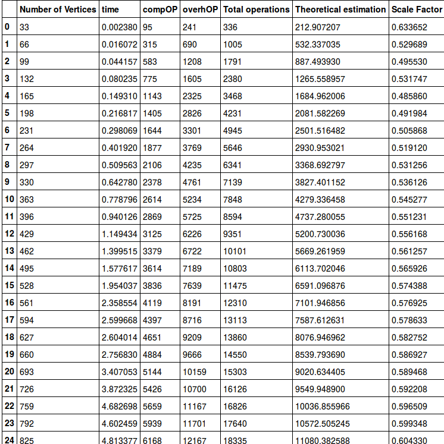

# Dijkstra Algorithm

## Algorithm overview

Dijkstra's algorithm is an algorithm for finding the shortest paths between nodes in a graph, which may represent, for example, road networks. It was conceived by computer scientist **Edsger W. Dijkstra** in 1956 and published three years later.  

The algorithm has a lot of variants of implementation. Dijkstara's original variant found the shortest path between two nodes, but usually people fix single node as the 'source' and finds shortest paths from the source to all other nodes in the graph, producing shortest path tree or another data structure.

In this implementation we choosed to variant where we are choosing "sourse" node and looking for the shortest path to the each node. To implement this algorithm we've used python language.

For a given source node in the graph, the algorithm finds the shortest path between that node and every other. It can also be used for finding the shortest paths from a single node to a single destination node by stopping the algorithm once the shortest path to the destination node has been determined. For example, if the nodes of the graph represent cities and edge path costs represent driving distances between pairs of cities connected by a direct road, Dijkstra's algorithm can be used to find the shortest route between one city and all other cities. As a result, the shortest path algorithm is widely used in network routing protocols.

## Description of the algorithm

Let the starting node be called **source node**. The **distance of node A** be the distance from the **source node** to A. The main idea of Dijkstra's algorithm, is that we assign the shortest distances from **source node** to each other node as some value (for example **infinity**) and try to improve this value step by step.

1. **Assign** to every node a tentative distance value: set it to zero for our initial node and to infinity for all other nodes.
2. Set the **source** node as current. Mark all other nodes unvisited. Create a set of all the **unvisited** nodes called the unvisited  set.
3. For the current node, consider all of its unvisited neighbors and calculate their tentative distances. Compare the newly calculated tentative distance to the current assigned value and assign the smaller one. **For example**, if the current node **A** is marked with a distance of 6, and the edge connecting it with a neighbor **B** has length 2, then the distance to **B** (through **A**) will be 6 + 2 = 8. If **B** was previously marked with a distance greater than 8 then change it to 8. Otherwise, keep the current value.
4. When we are done considering all of the neighbors of the current node, mark the current node as visited and remove it from the unvisited set. A visited node will never be checked again.
5. If the destination node has been marked visited (when planning a route between two specific nodes) or if the smallest tentative distance among the nodes in the unvisited set is infinity (when planning a complete traversal; occurs when there is no connection between the initial node and remaining unvisited nodes), then stop. The algorithm has finished.
6. Otherwise, select the unvisited node that is marked with the smallest tentative distance, set it as the new "current node", and go back to step 3.

## Implementation

### Straightforward

As we said our implementation have been done in python language. 

We wrote graph data structure and function dijkstra which takes 2 parameters:
``` python
def dijkstra(graph, initial):
```
This is a part of the code, where all diffrient variants of dijkstra algorithm have difrence:
``` python
 nodes = set(graph.nodes)
    while nodes:
        min_node = None
        for node in nodes:
            if node in visited:
                if min_node is None:
                    min_node = node
                elif visited[node] < visited[min_node]:
                    min_node = node
        if min_node is None:
            break
```
This part show why **straightforward** impolementation not very efficient. This part just trying to find min weighted node among unvisited nodes in the graph (point 3 in the **Description of the algorithm**).

The code below it's the main part of dijkstra's algorithm. it's just looking for the shortest path from our point to other.
```python
        nodes.remove(min_node)
        current_weight = visited[min_node]

        for edge in graph.edges[min_node]:
            try:
                weight = current_weight + graph.weights[(min_node, edge)]
            except:
                continue
            if edge not in visited or weight < visited[edge]:
                visited[edge] = weight
                path[edge] = min_node
    return (visited, path)
```

### Heap-based


The variant of algorihm don't need to look for min weithet node using loop, because we're using heap-based queue. Which on each step give us the node with smollest weight, below you can see code of implementation.
```python
def lst_dijkstra_with_heap(graph, source):
    dist = {}
    prev = {}
    dist[source] = 0
    unvisited = []
    nodes = graph.nodes

    for node in nodes:
        if node != source:
            dist[node] = float('inf')
            prev[node] = None
        heappush(unvisited,(dist[node], node))

    while unvisited:
        min_node = heappop(unvisited)[1]
        for node_neighbours in graph.edges[min_node]:
            tmp = dist[min_node] + graph.weights[(min_node, node_neighbours)]
            if tmp < dist[node_neighbours]:
                dist[node_neighbours] = tmp
                prev[node_neighbours] = min_node
                heappush(unvisited, (dist[node_neighbours], node_neighbours))

    return dist, prev
```
## Theoretical performance comparation

|                        | Straightforwars   | Heap-Based      |
| ---------------------- | ----------------- | --------------- |
| Worst-case performance |    O(e + v^2)     | O((e+v)log(v))  |
| Average performance    |    O(e + v^2)     | O((e+v)log(v))  |
| Best-case performance  |    O(e + v^2)     | O((e+v)log(v))  |

## Result

The program to compare algorithms is a console application.

# Dijkstra Algorithm

## Algorithm overview

Dijkstra's algorithm is an algorithm for finding the shortest paths between nodes in a graph, which may represent, for example, road networks. It was conceived by computer scientist **Edsger W. Dijkstra** in 1956 and published three years later.

The algorithm has a lot of variants of implementation. Dijkstara's original variant found the shortest path between two nodes, but usually people fix single node as the 'source' and finds shortest paths from the source to all other nodes in the graph, producing shortest path tree or another data structure.

In this implementation we choosed to variant where we are choosing "sourse" node and looking for the shortest path to the each node. To implement this algorithm we've used python language.

For a given source node in the graph, the algorithm finds the shortest path between that node and every other. It can also be used for finding the shortest paths from a single node to a single destination node by stopping the algorithm once the shortest path to the destination node has been determined. For example, if the nodes of the graph represent cities and edge path costs represent driving distances between pairs of cities connected by a direct road, Dijkstra's algorithm can be used to find the shortest route between one city and all other cities. As a result, the shortest path algorithm is widely used in network routing protocols.

## Description of the algorithm

Let the starting node be called **source node**. The **distance of node A** be the distance from the **source node** to A. The main idea of Dijkstra's algorithm, is that we assign the shortest distances from **source node** to each other node as some value (for example **infinity**) and try to improve this value step by step.

1. **Assign** to every node a tentative distance value: set it to zero for our initial node and to infinity for all other nodes.
2. Set the **source** node as current. Mark all other nodes unvisited. Create a set of all the **unvisited** nodes called the unvisited  set.
3. For the current node, consider all of its unvisited neighbors and calculate their tentative distances. Compare the newly calculated tentative distance to the current assigned value and assign the smaller one. **For example**, if the current node **A** is marked with a distance of 6, and the edge connecting it with a neighbor **B** has length 2, then the distance to **B** (through **A**) will be 6 + 2 = 8. If **B** was previously marked with a distance greater than 8 then change it to 8. Otherwise, keep the current value.
4. When we are done considering all of the neighbors of the current node, mark the current node as visited and remove it from the unvisited set. A visited node will never be checked again.
5. If the destination node has been marked visited (when planning a route between two specific nodes) or if the smallest tentative distance among the nodes in the unvisited set is infinity (when planning a complete traversal; occurs when there is no connection between the initial node and remaining unvisited nodes), then stop. The algorithm has finished.
6. Otherwise, select the unvisited node that is marked with the smallest tentative distance, set it as the new "current node", and go back to step 3.

## Implementation

### Straightforward

As we said our implementation have been done in python language.

We wrote graph data structure and function dijkstra which takes 2 parameters:
``` python
def dijkstra(graph, initial):
```
This is a part of the code, where all diffrient variants of dijkstra algorithm have difrence:
``` python
 nodes = set(graph.nodes)
    while nodes:
        min_node = None
        for node in nodes:
            if node in visited:
                if min_node is None:
                    min_node = node
                elif visited[node] < visited[min_node]:
                    min_node = node
        if min_node is None:
            break
```
This part show why **straightforward** impolementation not very efficient. This part just trying to find min weighted node among unvisited nodes in the graph (point 3 in the **Description of the algorithm**).

The code below it's the main part of dijkstra's algorithm. it's just looking for the shortest path from our point to other.
```python
        nodes.remove(min_node)
        current_weight = visited[min_node]

        for edge in graph.edges[min_node]:
            try:
                weight = current_weight + graph.weights[(min_node, edge)]
            except:
                continue
            if edge not in visited or weight < visited[edge]:
                visited[edge] = weight
                path[edge] = min_node
    return (visited, path)
```

### Heap-based


The variant of algorihm don't need to look for min weithet node using loop, because we're using heap-based queue. Which on each step give us the node with smollest weight, below you can see code of implementation.
```python
def lst_dijkstra_with_heap(graph, source):
    dist = {}
    prev = {}
    dist[source] = 0
    unvisited = []
    nodes = graph.nodes

    for node in nodes:
        if node != source:
            dist[node] = float('inf')
            prev[node] = None
        heappush(unvisited,(dist[node], node))

    while unvisited:
        min_node = heappop(unvisited)[1]
        for node_neighbours in graph.edges[min_node]:
            tmp = dist[min_node] + graph.weights[(min_node, node_neighbours)]
            if tmp < dist[node_neighbours]:
                dist[node_neighbours] = tmp
                prev[node_neighbours] = min_node
                heappush(unvisited, (dist[node_neighbours], node_neighbours))

    return dist, prev
```
## Theoretical performance comparation

|                        | Straightforwars   | Heap-Based      |
| ---------------------- | ----------------- | --------------- |
| Worst-case performance |    O(e + v^2)     | O((e+v)log(v))  |
| Average performance    |    O(e + v^2)     | O((e+v)log(v))  |
| Best-case performance  |    O(e + v^2)     | O((e+v)log(v))  |

## Result

The program to compare algorithms is a console application.


All raw results, which generated by application, can be found in results folder in .txt files. We used the Ipython notebook to prepare final charts. Charts were ploted by matplotlib libary.

Let's look at ou results.


