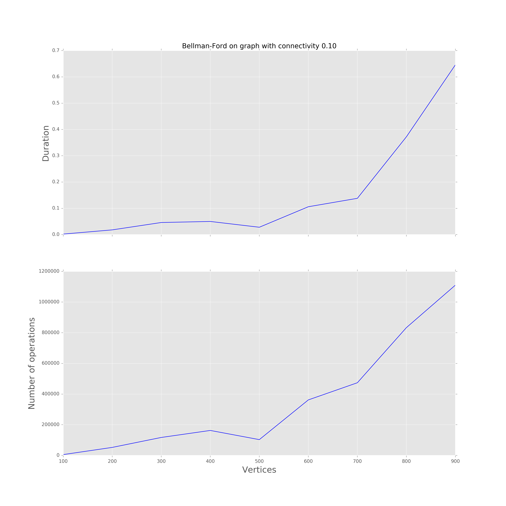
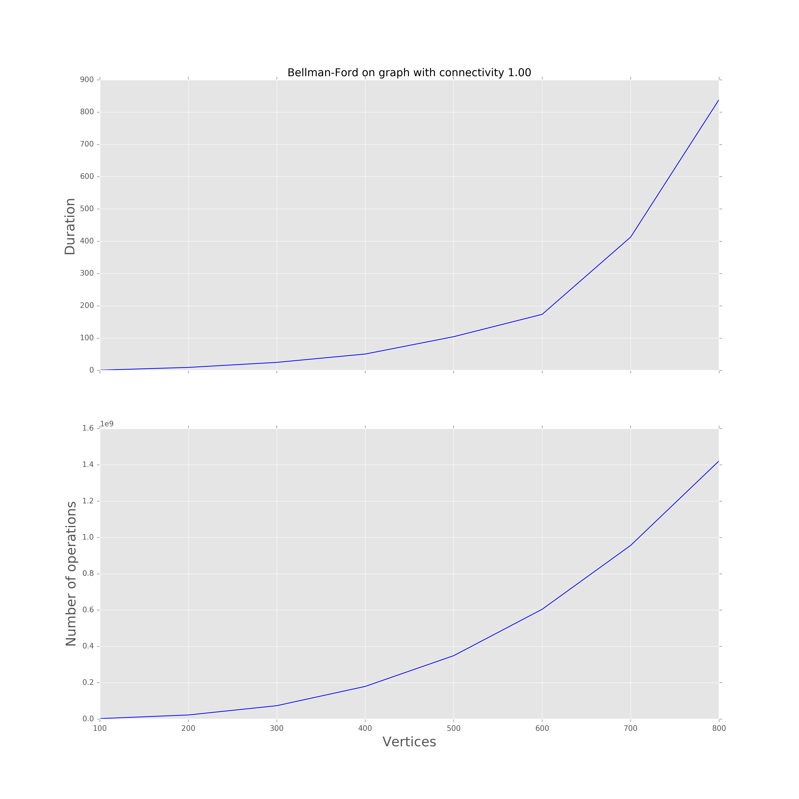
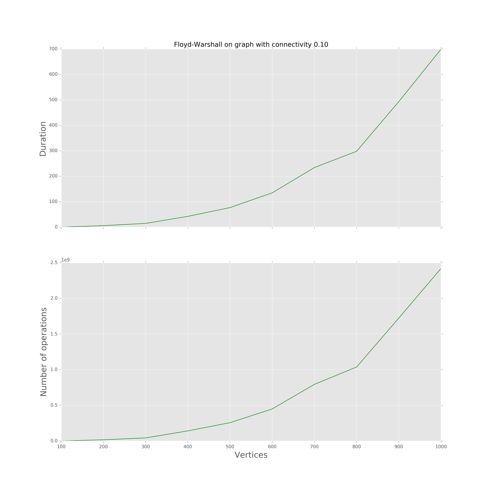
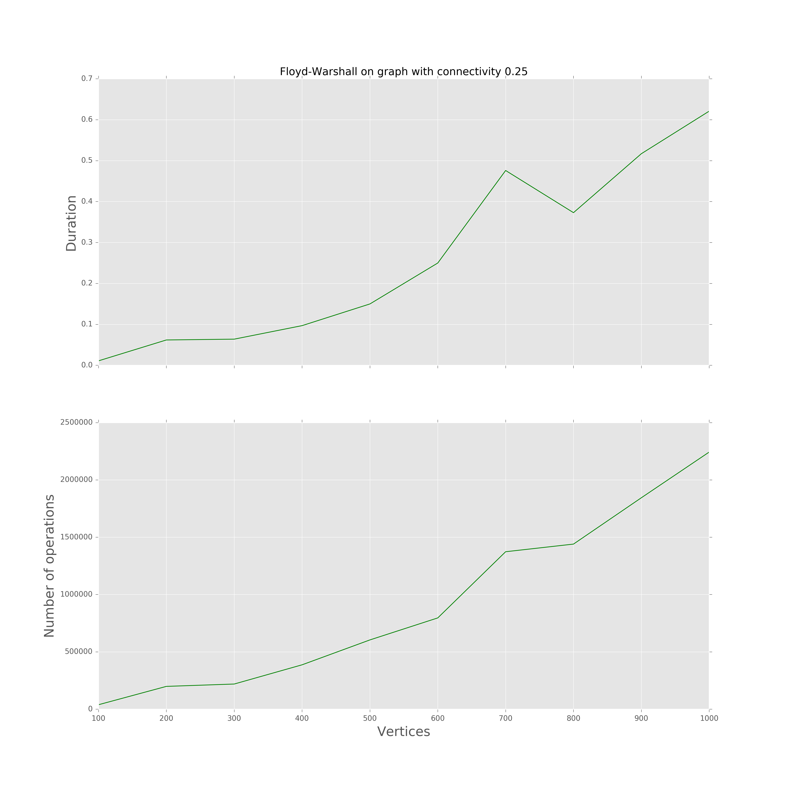
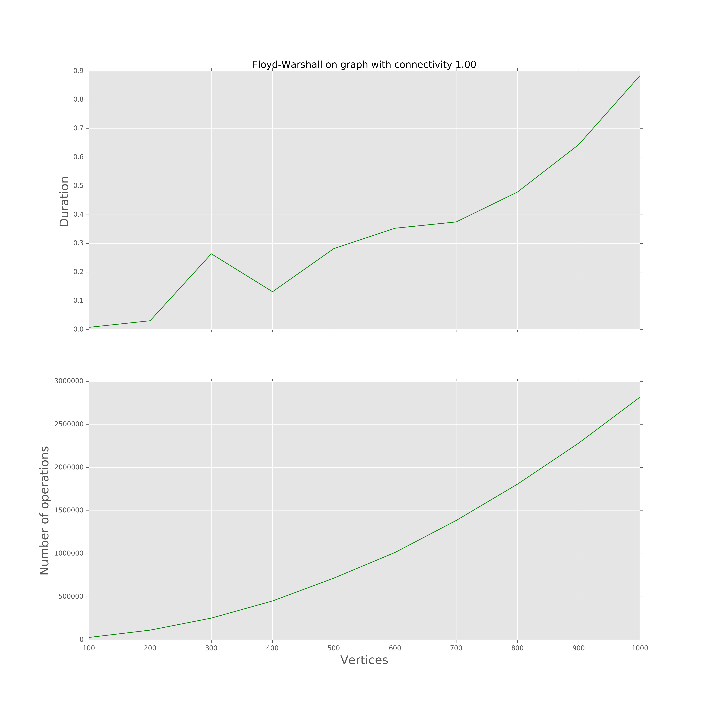
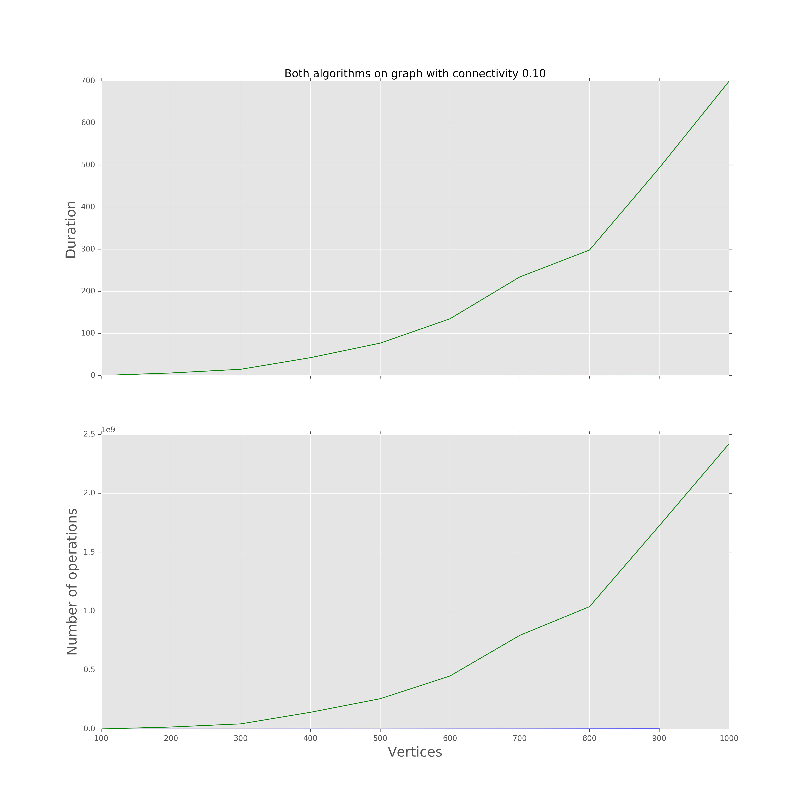
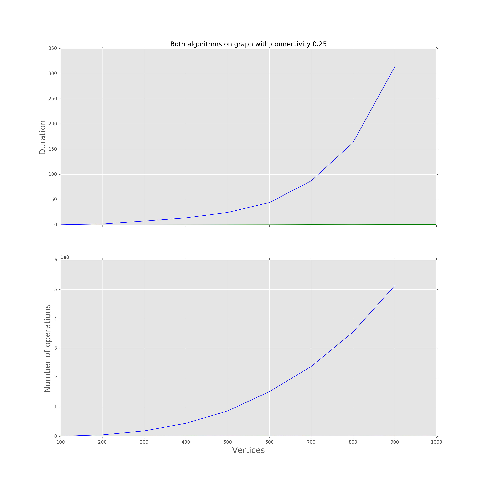
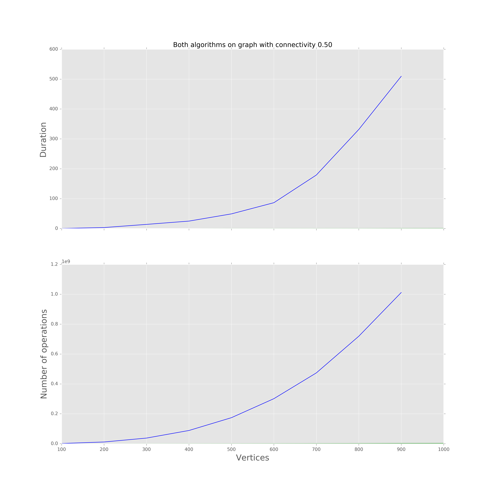

# Negative weight cycle detection
## Algorithms description

Shortest path problem solution with Dijkstra's algorithm is fast but also vulnerable to graphs with negative cycles. Because of Dijkstra's greedy approach to minimizing path weight, it can stay in an infinite negative cycle.

Thus arises a new problem of negative cycle detection. And for a solution could be used side effect of another shortest path algorithms. Bellman-Ford and Floyd-Warshall algorithms are slower than Dijkstra's, but their approach is more stable and allow to detect a presence of negative cycle in a target graph.

### Bellman-Ford algorithm for negative cycle detection

This algorithm uses a similar principle of vertex relaxation, in which approximation of the correct distance is gradually replaced by more accurate values until eventually reaching the optimum solution. Approximation always is an overestimate of a true distance between a vertex and a source, and it is replaced with a new found path if it is shorter. But instead of greedily select next vertex for the path from the queue of closest not processed vertices as Dijkstra's does, Bellman-Ford consequently relaxes all edges for `|V|-1` times, where `|V|` is a number of vertices in the graph.

1. **Initialize**. On the beginning, algorithm initializes two collections of size `V` to store distance and predecessor for every vertex in the path. Source vertex has an empty predecessor, and its distance is equal to zero.
2. **Relaxation**. On every relaxation iteration algorithm consequently check for every edge `e(v,u)` a condition: `distance[u]` is less than `distance[v] + e.weight`. If It is true than a shorter path from the source vertex to `u` with predecessor `v` exists. Then `distance[u]` is set to `distance[v] + e.weight`, and `predecessor[u]` is set to `v`. It is proven by induction that it is enough to do `n` steps to find all shortest path with length `n` in a graph. Thus relaxation step is repeated `|V|-1` to find all possible shortest paths in a graph with `|V|` vertices which contains no negative loops.
3. **Negative cycle check**. In the end, algorithm repeats the relaxation step one more time. If any edge `e(v,u)` detected where `distance[u] > distance[v] + e.weight` is true, then graph contains negative loop. The explanation is simple: path with a length `|V|` definitely contains a cycle. And it is a negative cycle because any positive loop can not be included in the path because the shortest path can not contain non-negative loops.

This algorithm uses at most `O(|V|*|E|)` operations in the main loop for the worst case. In the best case, if all edges are sorted in order of distance from source vertex, it will use `O(|E|)` operations.
For example, consider graph with 4 edges and 5 vertices `(d,e, 1),(c,d, 3),(b,c, 2),(a,b,3)` with source vertex `a`.

#### Distance iterations

| a | b   | c   | d   | e   |
|---|-----|-----|-----|-----|
| 0 | inf | inf | inf | inf |
| 0 | 3   | inf | inf | inf |
| 0 | 3   | 5   | inf | inf |
| 0 | 3   | 5   | 8   | inf |
| 0 | 3   | 5   | 8   | 9   |

#### Predecessors iteration

| a    | b    | c    | d    | e    |
|------|------|------|------|------|
| None | None | None | None | None |
| None | a    | None | None | None |
| None | a    | b    | None | None |
| None | a    | b    | c    | None |
| None | a    | b    | c    | d    |

### Floyd-Warshall algorithm for negative cycle detection
Floyd-Warshall algorithm also introduces the inductive approach to the shortest path problem solution. On every step, it looks for a possible shortest path between all pairs of vertices in a graph, which uses one selected node as intermediate pitstop. It operates with a matrix `|V|` by `|V|`, where each element contains shortest path distance between `i`-th and `j`-th vertex of a graph on a current step.
1. **Initialization**. On a step 0 adjacency matrix is copied to the distance matrix. Predecessor matrix formed from elements `predecessor_ij` where `predecessor_ij` - vertex `j` if there edge from `j` to `i`.
2. **Main loop**. On each iteration algorithm consequently select one vertice `p` to be used as a pitstop. Then it checks each pair of vertices (each element of a distance matrix) if a path from vertex `i` to vertex `j` (respective to the matrix row and column) which uses vertex `p` shorter than a current distance between `i` and `j`. If yes, the distance between `i` and `j` updated with vertex `p` set a predecessor. In terms of exact computational operations, algorithm just checks if `distance[i][p] + distance[p][j] < distance[i][j]`.
3. **Negative cycle check**. Initially `distance[i,i]` for `i=1..|V|` is equal to zero, because it is a distance from vertex `i` to itself. During the main loop, algorithm consequently revises distances between all vertices, and if vertex `i` is a part of a negative cycle, distance from `i` to `i` itself becomes less than zero. Thus algorithm could just check all diagonal entries of the distance matrix to find a negative cycle in the graph.

In the main loop algorithm performs `|V|*|V|*|V|` iteration for any case, so the best computational approximation would be `Omega(|V|^3)`.

## Implementation

Python is a modern and widely used language for scientific computations. It is widely used in researches and business solutions. But it has low performance in loops because it interpreted and dynamically typed. However, we decided to use it for our implementations to understand possible ways of it optimization.
Both algorithms already have been implemented for the shortest path search. But for the task of negative cycle detection, we need slightly improve algorithms and use custom implementations. Let's review each of them in details.

### Bellman-Ford implementation

Our implementation is based on pseudocode from Wikipedia. First of all, we noticed that this implementation lacks early stopping point in the main loop. Our idea was to count the relaxed edges on a current iteration. If there were no relaxations in for one iteration, then it is clear that algorithm had found shortest paths for all vertices, visible from source. These changes slightly improved performance, but only for sparse graphs without negative cycles. In graphs with negative cycles, relaxation process is infinite, and our improvement has no influence on performance.

The second problem was graphs with more than one element of connectivity. Bellman-Ford is looking for the shortest path to the only one source vertex and thus will never relax edges invisible to the source. But we changed the implementation to repeat algorithm relaxation process on every connectivity element. Therefore our implementation detects negative cycles in all isolated subgraphs and could also be used for counting of the graph connectivity elements.

### Floyd-Warshall implementation

Floyd-Warshall checks all possible paths from one vertice to another, therefore it is free of Bellman-Ford problem with invisible edges. It also could be changed to became more efficient in particular negative cycle detection problem. It turns out that it uses diagonal entries of the distance matrix as a detector of negative cycle presence after the main loop execution, but for early detection of negative cycle algorithm could stop the main loop at the moment when any diagonal distance becomes negative because it clearly proves a presence of negative cycle. Therefore the performance of Floyd-Warshall could be drastically improved if it stops on the first negative cycle detected.

For our implementation, complexity estimation is different from the classical implementation. In the best case, the algorithm will stop after the first iteration of the main loop. Thus best case complexity can be estimated as `O(|V|^2)`. The best case probability depends on a number of negative cycles in data.

### Theoretical performance comparison

|                        | Bellman-Ford   | Floyd-Warshall |
| ---------------------- | -------------- | -------------- |
| Worst-case performance | O(\|V\|*\|E\|) | O(\|V\|^3)     |
| Average performance    | O(\|V\|*\|E\|) | O(\|V\|^2)     |
| Best-case performance  | O(\|E\|)       | O(\|V\|^2)     |

### Technical details of implementation

Source code can be find in [negative-cycle](https://github.com/rudnitskih/ucu-adc-coursework/tree/master/graphs/negative-cycle) folder. Code was written in [PyCharm](tps://www.jetbrains.com/pycharm/) IDE and interpreted by [Python 2.7](https://www.python.org/download/releases/2.7/).

The code can be divided into the following parts:

- **negative_cycle.py**, implementation of negative cycle detection algorithms;
- **utils.py**, random graph generator, negative cycle generator and helper functions;
- **tests.py**, unit tests for utils and negative cycle detection algorithms;
- **floyd_warshall_performance_test.py**, performance tests for Floyd-Warshall implementation;
- **bellman_ford_performance_test.py**, performance tests for Bellman-Ford implementation;
- **currencies.py**, negative cycle detection script for the real currencies data;

## Performance testing

For both implementations we have found an amount of operations depends not only on an amount of vertices, but also on  an amount of  edges. Therefore we have decided to test our implementations on a dense and sparse graphs. Generated graphs has connectivity parameter in set `0.1, 0.25, 0.5, 0.75, 1.0`. Here connectivity means a probability of having two arbitrary vertices in graph connected.

Results prepared on the machine with following characteristics:
- Laptop HP Pavilion SR079
- OS Windows 8.1 64 bit
- Processor Intel® Core™ i5-4200U 2.3 GHz x 4
- 12 Gb RAM

To minimize an influence of environment, we have run compiled program after reboot and have not started other processes. To reduce an influence of multithreaded environment, explicitly set number of used threads to one by python instruction `mkl.set_num_threads(1)`. For time measurement we used Python library function `time.time()`.

All raw results, which generated by application, can be found in [results](https://github.com/rudnitskih/ucu-adc-coursework/tree/master/graphs/negative-cycle/results) folder. Files stored in csv format without header. Header description: {No of vertices} {Execution time} {No of operations}. File name format is {algorithm_name}-{connectivity}.txt.
All charts can be found in [images](https://github.com/rudnitskih/ucu-adc-coursework/tree/master/graphs/negative-cycle/images) folder. We used the free python library `matplotlib` to prepare the charts.

### Bellman-Ford performance

As you can see on charts, Bellman-Ford number of operation and execution time drastically increases with the connectivity parameter. The same graph with 800 vertices processed in ~ 0.6 seconds for connectivity 0.1 and in 900 seconds for connectivity 1.0 (dense graph).
### Floyd-Warshall performance

Floyd-Warshall performance also depends on the graph connectivity, but with another effect. It takes 300 seconds to process a sparse graph with connectivity 0.1, whereas for connectivity 0.25 and bigger it detects a negative cycle in 0.7 seconds. It comes from the nature of our Floyd-Warshall implementation with early stopping feature on cycle detection: the more graph has edges, the higher number of negative cycles in it, the faster graph would stop. Actually, it depends not on connectivity itself, but on a density of negative cycles in a graph.

### Comparison

In comparison performance of the algorithms are so different, that you can see only one line at pictures, another lies on the x-axis. For sparse data Bellman-Ford shows a much better result. However, on dense data performance of Floyd-Warshall has significant advance.

## Conclusion
In this part, we compared two algorithms for negative cycle detection. It appears that their performance highly depends on graph statistical properties. Also, we managed to change classical implementations to have specialized cycle detection algorithms with better performance.

# Credits
- https://en.wikipedia.org/wiki/Bellman%E2%80%93Ford_algorithm
- https://www.youtube.com/watch?v=KQ9zlKZ5Rzc&t=215s "Floyd Warshall Algorithm: All-pairs Shortest-paths" by Joe James
- http://algo.epfl.ch/_media/en/courses/2011-2012/algorithmique-cycles-2011a.pdf Textbook for Algorithmique Course of Ecole Polytechnique
- https://en.wikipedia.org/wiki/Floyd%E2%80%93Warshall_algorithm
