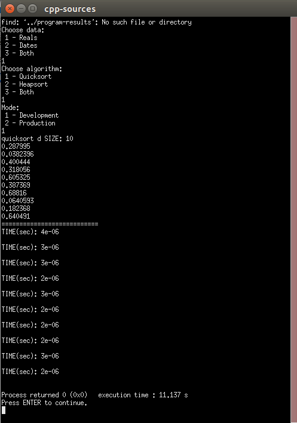

# Sorting
In our variant we need to compare two algorithms - Heapsort and Quicksort for different input types - reals and dates.

## Algorithms overivew
### Quicksort

Quicksort (sometimes called partition-exchange sort) is an efficient sorting algorithm developed by Tony Hoare in 1959, with his work published in 1961, it is still a commonly used algorithm for sorting. 

Quicksort is a comparison sort, meaning that it can sort items of any type for which a "less-than" relation (formally, a total order) is defined. In efficient implementations it is not a stable sort, meaning that the relative order of equal sort items is not preserved. Quicksort can operate in-place on an array, requiring small additional amounts of memory to perform the sorting.

Algorithm uses divide-and-conquer principe, and so it's a recursive algorithm.
Here is how quicksort uses divide-and-conquer. We need to think of sorting a subarray `array[p..r]`, where initially the subarray is `array[0..n-1]`.
	
1. **Divide** by choosing any element in the subarray `array[p..r]`. Call this element the **pivot**. Rearrange the elements in `array[p..r]` so that all other elements in `array[p..r]` that are less than or equal to the pivot are to its left and all elements in `array[p..r]` are to the pivot's right. We call this procedure `partitioning`. At this point, it doesn't matter what order the elements to the left of the pivot are in relative to each other, and the same holds for the elements to the right of the pivot. We just care that each element is somewhere on the correct side of the pivot.

2. **Conquer** by recursively sorting the subarrays `array[p..q-1]` (all elements to the left of the pivot, which must be less than or equal to the pivot) and `array[q+1..r]` (all elements to the right of the pivot, which must be greater than the pivot).

3. **Combine** by doing nothing. Once the conquer step recursively sorts, we are done. Why? All elements to the left of the pivot, in `array[p..q-1]`, are less than or equal to the pivot and are sorted, and all elements to the right of the pivot, in `array[q+1..r]`, are greater than the pivot and are sorted. The elements in `array[p..r]` can't help but be sorted!

Mathematical analysis of quicksort shows that, on average, the algorithm takes O(n log n) comparisons to sort n items. In the worst case, it makes O(n2) comparisons, though this behavior is rare. Although somewhat slower in practice on most machines than a well-implemented quicksort, it has the advantage of a more favorable worst-case O(n log n) runtime. 

### Heapsort

Heapsort is a comparison-based sorting algorithm. Heapsort can be thought of as an improved selection sort: like that algorithm, it divides its input into a sorted and an unsorted region, and it iteratively shrinks the unsorted region by extracting the largest element and moving that to the sorted region. The improvement consists of the use of a heap data structure rather than a linear-time search to find the maximum.

**Heap** is a specialized tree-based data structure that satisfies the heap property: If A is a parent node of B then the key (the value) of node A is ordered with respect to the key of node B with the same ordering applying across the heap. A heap can be classified further as either a "max heap" or a "min heap". In a max heap, the keys of parent nodes are always greater than or equal to those of the children and the highest key is in the root node. In a min heap, the keys of parent nodes are less than or equal to those of the children and the lowest key is in the root node.

The heap is one maximally efficient implementation of an abstract data type called a **priority queue**, and in fact priority queues are often referred to as "heaps", regardless of how they may be implemented. A common implementation of a heap is the binary heap, in which the tree is a complete binary tree (see figure).

<p align="center">
  
</p>

Heapsort was invented by J. W. J. Williams in 1964.[3] This was also the birth of the heap, presented already by Williams as a useful data structure in its own right.

The heapsort algorithm can be divided into two parts.

In the first step, a heap is built out of the data. The heap is often placed in an array with the layout of a complete binary tree. The complete binary tree maps the binary tree structure into the array indices; each array index represents a node; the index of the node's parent, left child branch, or right child branch are simple expressions. For a zero-based array, the root node is stored at index 0; if i is the index of the current node, then

```javascript
  iParent(i)     = floor((i-1) / 2) // where floor functions map a real number to the smallest leading integer.
  iLeftChild(i)  = 2*i + 1
  iRightChild(i) = 2*i + 2
```

In the second step, a sorted array is created by repeatedly removing the largest element from the heap (the root of the heap), and inserting it into the array. The heap is updated after each removal to maintain the heap. Once all objects have been removed from the heap, the result is a sorted array.

Heapsort is an in-place algorithm, but it is not a stable sort. The array can be split into two parts, the sorted array and the heap. The heap's invariant is preserved after each extraction, so the only cost is that of extraction.

The heapsort algorithm involves preparing the list by first turning it into a max heap. The algorithm then repeatedly swaps the first value of the list with the last value, decreasing the range of values considered in the heap operation by one, and sifting the new first value into its position in the heap. This repeats until the range of considered values is one value in length.

The steps are:

1. Call the `makeInitialHeap()` function on the list. Also referred to as `heapify()`, this builds a heap from a list in `O(n)` operations.
2. Swap the first element of the list with the final element. Decrease the considered range of the list by one.
3. Call the `sift()` function on the list to sift the new first element to its appropriate index in the heap.
4. Go to step (2) unless the considered range of the list is one element.

The `buildMaxHeap()` operation is run once, and is `O(n)` in performance. The `sift()` function is `O(log(n))`, and is called `n` times. Therefore, the performance of this algorithm is `O(n+n*log(n))` which evaluates to `O(nlog(n))`.

## Theoretical performance comparation

|                        | Quicksort   | Heapsort    |
| ---------------------- | ----------- | ----------- |
| Worst-case performance |    O(n^2)   | O(nlog(n))  |
| Average performance    | O(nlog(n))  | O(nlog(n))  |
| Best-case performance  | O(nlog(n))  | O(nlog(n))  |

## Implementation

For comparing these algorithms was chosen C++ language, because other high-level programming languages, e.g. Java, Javascript, C# are doing a lot of optimization internally. C++ is a compromise between low-level C and other mentioned languages. We want to mention that nobody in the team had experience working with C++. Hence, some code can be written not in "best-practices" of the language.

Source code can be find in [cpp-sources](https://github.com/rudnitskih/ucu-adc-coursework/tree/master/sorting/cpp-sources) folder. Code was writed in [Code Blocks](http://www.codeblocks.org/) IDE and compiled by [GCC](http://gcc.gnu.org/). Additionaly need to enable [C++11](http://stackoverflow.com/a/24398366) mode in Code Blocks.

The program to compare algorithms is a console application.



The code can be divided into the following parts:

- **generator**, for generating test values;
- **heapsort**, implementation heapsort algorithm;
- **quicksort**, implementation quicksort algorithm;
- **utils**, helper functions, e.g. `saveToFile()`, `compareDates()`;
- **main**, for managing flow of operations

## Conlusions

// TODO temp part
Thus, when an occasional "blowout" to `O(n^2) is tolerable, we can expect that, on average, quick sort will provide considerably better performance - especially if one of the modified pivot choice procedures is used.

Most commercial applications would use quicksort for its better average performance: they can tolerate an occasional long run (which just means that a report takes slightly longer to produce on full moon days in leap years) in return for shorter runs most of the time.

However, quick sort should never be used in applications which require a guarantee of response time, unless it is treated as an O(n2) algorithm in calculating the worst-case response time. If you have to assume `O(n^2)` time, then - if n is small, you're better off using insertion sort - which has simpler code and therefore smaller constant factors.

And if n is large, you should obviously be using heap sort, for its guaranteed O(nlog n) time. Life-critical (medical monitoring, life support in aircraft and space craft) and mission-critical (monitoring and control in industrial and research plants handling dangerous materials, control for aircraft, defence, etc) software will generally have a response time as part of the system specifications. In all such systems, it is not acceptable to design based on average performance, you must always allow for the worst case, and thus treat quicksort as O(n2).

## Credits
- https://www.khanacademy.org/computing/computer-science/algorithms/quick-sort/a/overview-of-quicksort
- https://en.wikipedia.org/wiki/Quicksort
- https://en.wikipedia.org/wiki/Heapsort
- https://en.wikipedia.org/wiki/Heap_(data_structure)
- https://www.cs.auckland.ac.nz/~jmor159/PLDS210/qsort3.html
- http://stackoverflow.com/questions/18591924/how-to-use-bitmask
- https://www.cs.auckland.ac.nz/~jmor159/PLDS210/qsort3.html